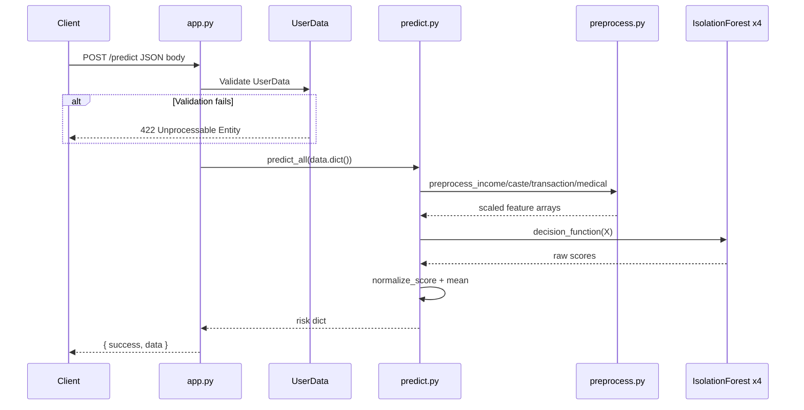

# API Contract

**Audit date:** 2026-06-18  
**Scope:** All AI/ML HTTP endpoints in the repository

---

## Endpoint Summary

| Route | Method | Service | Auth | Status |
| --- | --- | --- | --- | --- |
| `/` | GET | `services/ml` (FastAPI) | None | Implemented |
| `/predict` | POST | `services/ml` (FastAPI) | None | Implemented |
| `/test` | GET | `services/ml` (FastAPI) | None | Implemented |
| Next.js API routes | — | `apps/web` | — | **NOT FOUND IN CURRENT CODEBASE** |
| API gateway routes | — | `apps/api` | — | **NOT FOUND IN CURRENT CODEBASE** |
| Chat endpoints | — | — | — | **NOT FOUND IN CURRENT CODEBASE** |
| Search endpoints | — | — | — | **NOT FOUND IN CURRENT CODEBASE** |
| Recommendation endpoints | — | — | — | **NOT FOUND IN CURRENT CODEBASE** |

**Default ML service URL:** `http://localhost:8000` (Docker: `ml-service` on port 8000)

**Source:** `docker-compose.yml`, `services/ml/package.json` (`uvicorn src.app:app`)

---

## `GET /`

### Overview

Health / welcome endpoint.

| Attribute | Value |
| --- | --- |
| **Route** | `/` |
| **Method** | `GET` |
| **Handler** | `home()` |
| **Source** | `services/ml/src/app.py` lines 36–38 |
| **Authentication** | None |
| **Models used** | None |

### Request schema

No body. No query parameters.

### Response schema

```json
{
  "message": "Welfare Fraud Detection API is running"
}
```

### Error handling

Standard FastAPI/Starlette errors only. No custom error handlers defined.

### Internal services called

None.

---

## `POST /predict`

### Overview

Primary ML inference endpoint. Accepts a flat beneficiary feature payload and returns domain-level and aggregate fraud risk scores.

| Attribute | Value |
| --- | --- |
| **Route** | `/predict` |
| **Method** | `POST` |
| **Handler** | `predict(data: UserData)` |
| **Source** | `services/ml/src/app.py` lines 41–46 |
| **Authentication** | **None** |
| **Models used** | `income_model.pkl`, `caste_model.pkl`, `transaction_model.pkl`, `medical_model.pkl` |
| **Internal call chain** | `data.dict()` → `predict_all(data)` |

### Sequence diagram



### Request schema

**Content-Type:** `application/json`

All fields are **required**. Defined by Pydantic class `UserData` in `services/ml/src/app.py`.

```json
{
  "income_in_rs": 122962.0,
  "land_owned_acres": 1.73,
  "vehicles_owned": 2,
  "electricity_consumption": 286.0,
  "pending_loans": 1,
  "business_ownership": 1,
  "caste": "OBC",
  "father_caste": "OBC",
  "avg_caste_population_per": 0.18,
  "officer_approvals_per_day": 14.0,
  "weekly_spending": 2504.0,
  "monthly_spending": 9853.0,
  "transaction_count": 56,
  "avg_transaction_value": 175.0,
  "luxury_items_bought": 2,
  "weekend_spending_ratio": 0.19,
  "hospital_visits_per_year": 2,
  "claim_frequency": 2,
  "medical_claim_amount": 3825.0,
  "avg_claim_amount": 1095.0,
  "chronic_disease": 1
}
```

#### Field definitions

| Field | Pydantic type | Required | Notes |
| --- | --- | --- | --- |
| `income_in_rs` | `float` | Yes | Annual income in INR |
| `land_owned_acres` | `float` | Yes | |
| `vehicles_owned` | `int` | Yes | |
| `electricity_consumption` | `float` | Yes | |
| `pending_loans` | `int` | Yes | |
| `business_ownership` | `int` | Yes | 0/1 flag |
| `caste` | `str` | Yes | Training categories: General, OBC, SC, ST |
| `father_caste` | `str` | Yes | Same categories |
| `avg_caste_population_per` | `float` | Yes | |
| `officer_approvals_per_day` | `float` | Yes | |
| `weekly_spending` | `float` | Yes | |
| `monthly_spending` | `float` | Yes | |
| `transaction_count` | `int` | Yes | |
| `avg_transaction_value` | `float` | Yes | |
| `luxury_items_bought` | `int` | Yes | |
| `weekend_spending_ratio` | `float` | Yes | |
| `hospital_visits_per_year` | `int` | Yes | |
| `claim_frequency` | `int` | Yes | |
| `medical_claim_amount` | `float` | Yes | |
| `avg_claim_amount` | `float` | Yes | |
| `chronic_disease` | `int` | Yes | 0/1 flag |

#### Validation rules

- Pydantic type coercion applies (e.g., integer accepted where float expected).
- No explicit range, enum, or regex constraints in code.
- No `user_id` or profile reference field.

### Response schema

**Success (200):**

```json
{
  "success": true,
  "data": {
    "income_risk": 0.0,
    "caste_risk": 0.0,
    "transaction_risk": 0.0,
    "medical_risk": 0.0,
    "final_risk": 0.0
  }
}
```

| Field | Type | Description |
| --- | --- | --- |
| `success` | `boolean` | Always `true` on success |
| `data.income_risk` | `float` | Sigmoid-normalized income anomaly risk ~[0, 1] |
| `data.caste_risk` | `float` | Caste domain risk |
| `data.transaction_risk` | `float` | Transaction domain risk |
| `data.medical_risk` | `float` | Medical domain risk |
| `data.final_risk` | `float` | Arithmetic mean of four domain risks |

**Source:** `services/ml/src/predict.py` — `predict_all()` return dict

### Error handling

| Condition | HTTP status | Behavior |
| --- | --- | --- |
| Missing/invalid JSON field | 422 | Pydantic validation error (FastAPI default) |
| Missing `models/*.pkl` at startup | N/A | Process fails to start (import error) |
| Runtime sklearn/numpy errors | 500 | Unhandled exception → FastAPI default 500 |
| Unknown `caste` value | 200 | Silent — OHE produces zero vector (`handle_unknown="ignore"`) |

No custom exception handlers, rate limiting, or request ID logging.

### Internal services called

| Service | Function | File |
| --- | --- | --- |
| Preprocessing | `preprocess_income`, `preprocess_caste`, `preprocess_transaction`, `preprocess_medical` | `services/ml/src/preprocess.py` |
| Inference | `predict_all`, `normalize_score` | `services/ml/src/predict.py` |
| Database | — | **Not called** |

### Models used

1. `income_model.pkl` — IsolationForest
2. `caste_model.pkl` — IsolationForest
3. `transaction_model.pkl` — IsolationForest
4. `medical_model.pkl` — IsolationForest

Plus preprocessors: 4 scalers + 1 encoder (see `MODEL_MAPPING.md`).

---

## `GET /test`

### Overview

Runs built-in sample predictions for manual smoke testing.

| Attribute | Value |
| --- | --- |
| **Route** | `/test` |
| **Method** | `GET` |
| **Handler** | `test()` |
| **Source** | `services/ml/src/app.py` lines 49–53 |
| **Authentication** | **None** |
| **Models used** | Same four IsolationForest models |

### Request schema

No body. No query parameters.

### Response schema

```json
{
  "success": true,
  "result": [
    {
      "income_risk": 0.0,
      "caste_risk": 0.0,
      "transaction_risk": 0.0,
      "medical_risk": 0.0,
      "final_risk": 0.0
    }
  ]
}
```

`result` is an array of 3 prediction objects (one per fixture in `services/ml/src/test.py`).

### Error handling

Same as `/predict` — unhandled exceptions → 500.

### Internal services called

| Service | Function | File |
| --- | --- | --- |
| Test runner | `run_test_predictions()` | `services/ml/src/test.py` |
| Inference | `predict_all()` | `services/ml/src/predict.py` |

---

## Services With No ML Endpoints

### `apps/api`

**Source:** `apps/api/index.ts`

```typescript
console.log("Hello via Bun!");
```

No HTTP server, no routes, no ML proxy despite `docker-compose.yml` declaring dependency on `ml-service`.

### `apps/web`

No `route.ts` or `pages/api` handlers found. Frontend does not expose or proxy ML endpoints.

---

## Planned Future Contract (NOT IMPLEMENTED)

Documented design intent from `docs/database-architecture.md` and prior audit — **not in code**:

```json
{
  "user_id": "<student_profile_uuid>"
}
```

Would resolve: `student_profiles` → latest `feature_snapshots` → `predict_all()` → `prediction_records` INSERT.

See `GAP_ANALYSIS.md` for gaps blocking this contract.

---

## Infrastructure Notes

| Item | Value | Source |
| --- | --- | --- |
| ML port | 8000 | `docker-compose.yml` |
| API port | 3001→3000 | `docker-compose.yml` |
| Web port | 3000 | `docker-compose.yml` |
| Dockerfile CMD | `uvicorn app.main:app` (**broken**) | `services/ml/Dockerfile` |
| Working package.json CMD | `uvicorn src.app:app` | `services/ml/package.json` |
| OpenAPI docs | Auto-generated at `/docs` (FastAPI default) | FastAPI convention |

---

## Authentication Matrix

| Endpoint | Auth mechanism | Status |
| --- | --- | --- |
| All ML endpoints | None | Open |
| JWT (README claim) | — | **NOT FOUND IN CURRENT CODEBASE** |

**Source:** `services/ml/src/app.py` — no middleware or dependency injection for auth.
