# Architecture Diagrams

**Audit date:** 2026-06-18  
**Scope:** Text-based and Mermaid diagrams for the ML/AI system as it exists in code

Diagrams distinguish **implemented** (solid lines) from **planned / NOT FOUND** (dashed).

---

## 1. System Architecture

### High-level monorepo layout (as deployed in Docker Compose)

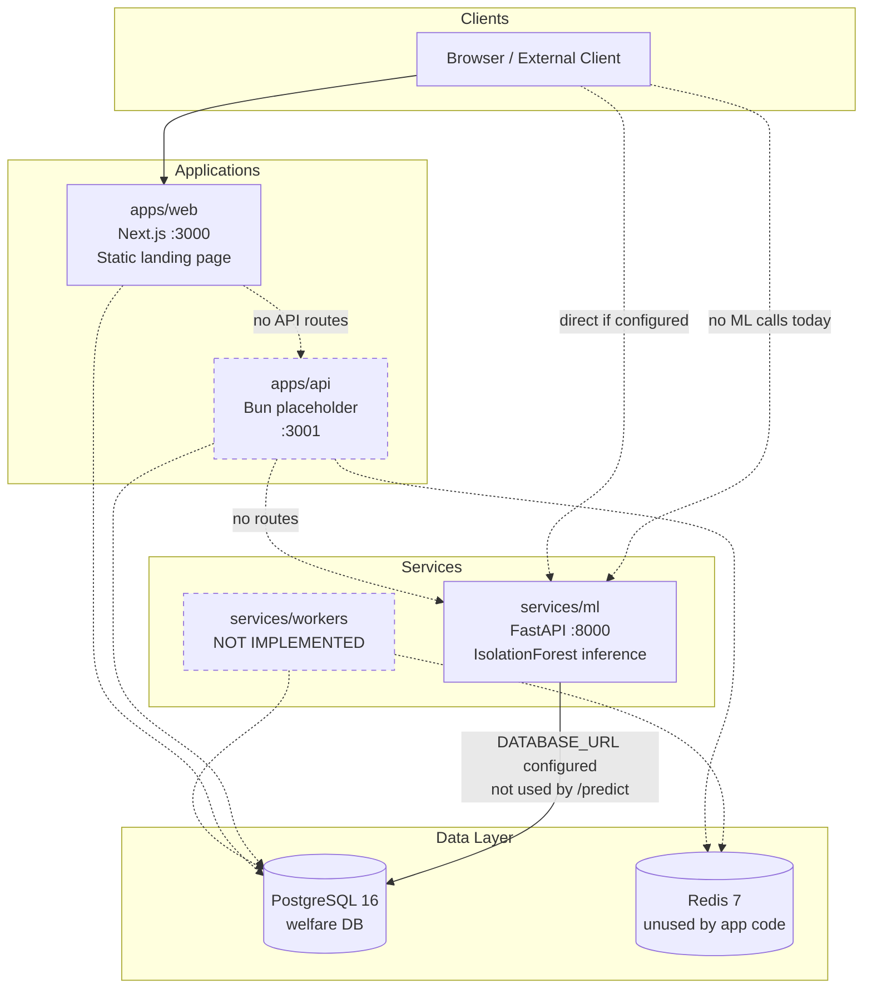

**Sources:** `docker-compose.yml`, `apps/api/index.ts`, `services/ml/src/app.py`, `apps/web/`

---

### ML service internal architecture

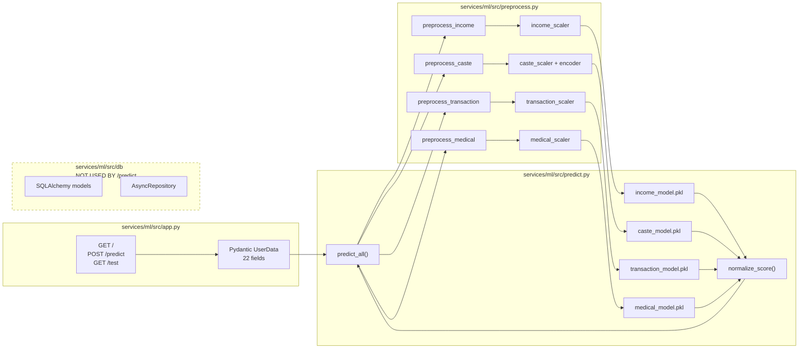

**Sources:** `services/ml/src/app.py`, `predict.py`, `preprocess.py`, `db/`

---

## 2. Recommendation Flow

**NOT FOUND IN CURRENT CODEBASE**

This repository does not implement a recommendation engine (collaborative filtering, content-based ranking, hybrid recommenders, or gift suggestions).

### Closest equivalent: Fraud risk aggregation (implemented)

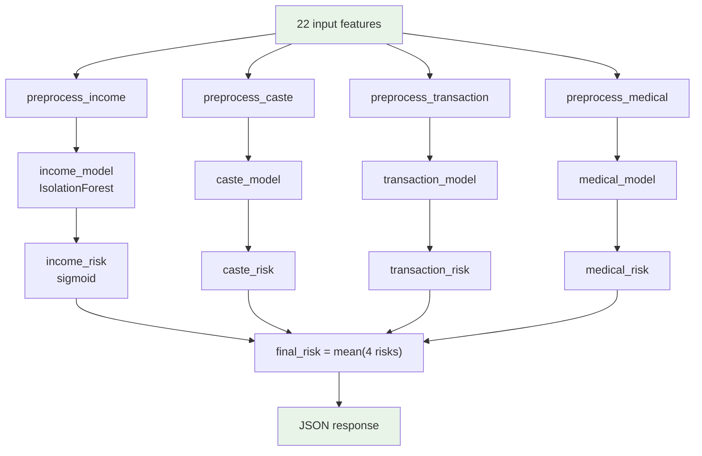

**Source:** `services/ml/src/predict.py` — `predict_all()`

There is no ranking of items, no candidate retrieval, and no personalization.

---

## 3. Search Flow

**NOT FOUND IN CURRENT CODEBASE**

No semantic search, keyword search, vector retrieval, or embedding pipeline exists.

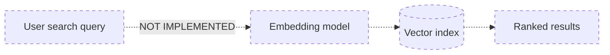

**Planned data access pattern (schema only):** profiles could be listed by `external_id` index on `student_profiles` — no search API exposes this.

**Source:** `packages/db/schema/student-profiles.ts`

---

## 4. Chatbot Flow

**NOT FOUND IN CURRENT CODEBASE**

No chat UI, conversation state, LLM calls, or RAG pipeline.

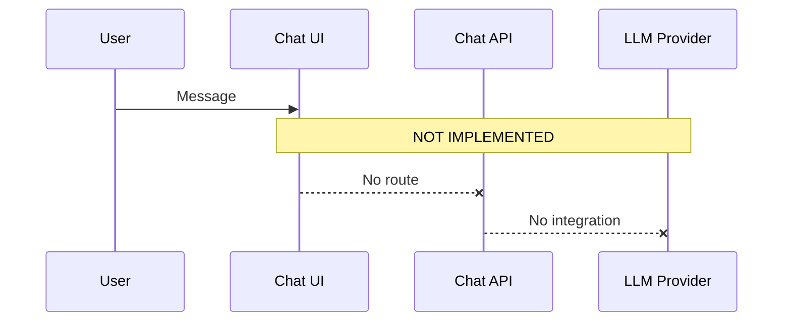

---

## 5. Data Flow

### 5a. Current inference data flow (implemented)

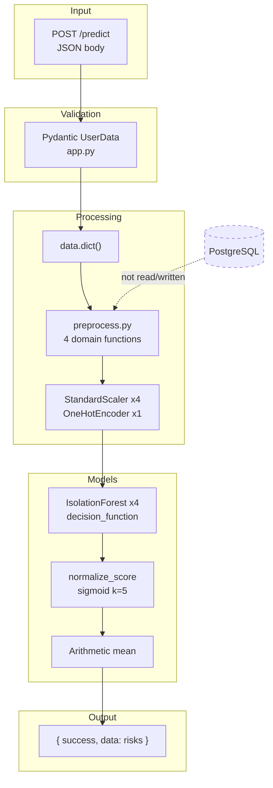

**Source:** `services/ml/src/app.py`, `predict.py`, `preprocess.py`

---

### 5b. Training data flow (implemented, offline)

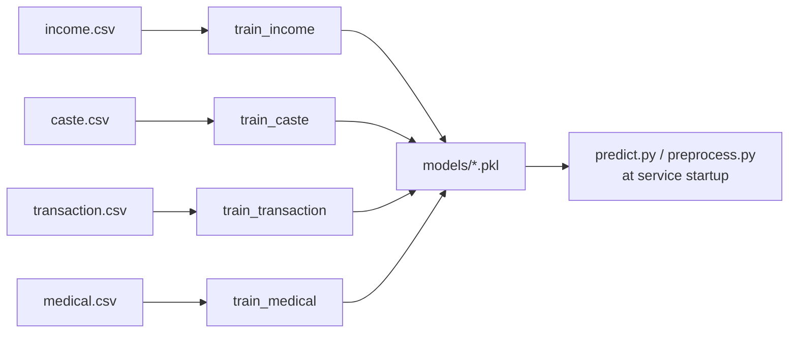

**Source:** `services/ml/src/train.py`, `services/ml/data/`

---

### 5c. Target production data flow (designed, NOT implemented)

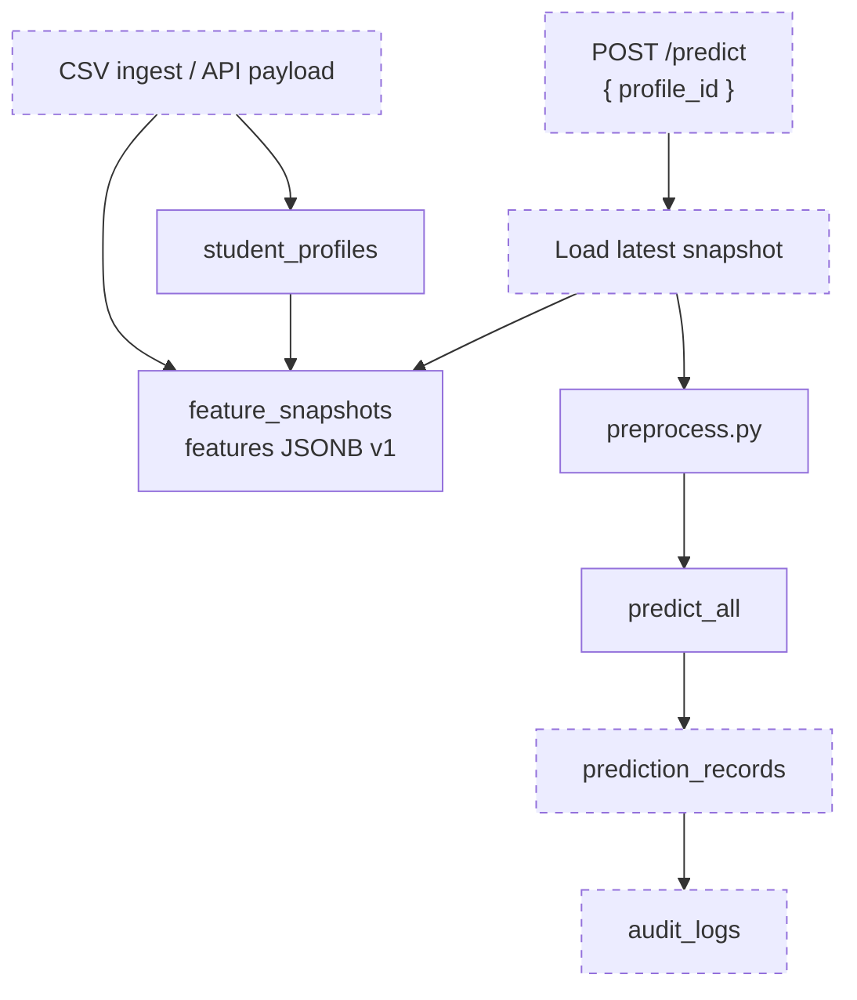

**Source:** `docs/database-architecture.md`

---

### 5d. Database entity relationships (implemented schema)

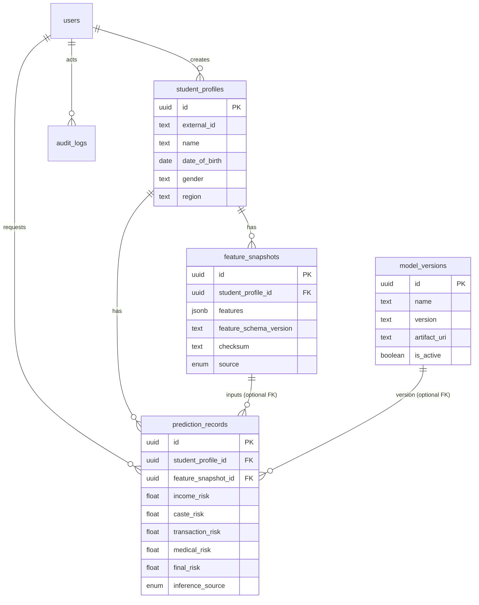

**Sources:** `packages/db/schema/*.ts`, `services/ml/src/db/models/*.py`

---

## 6. Service Communication Flow

### 6a. Docker Compose service dependencies (implemented infrastructure)

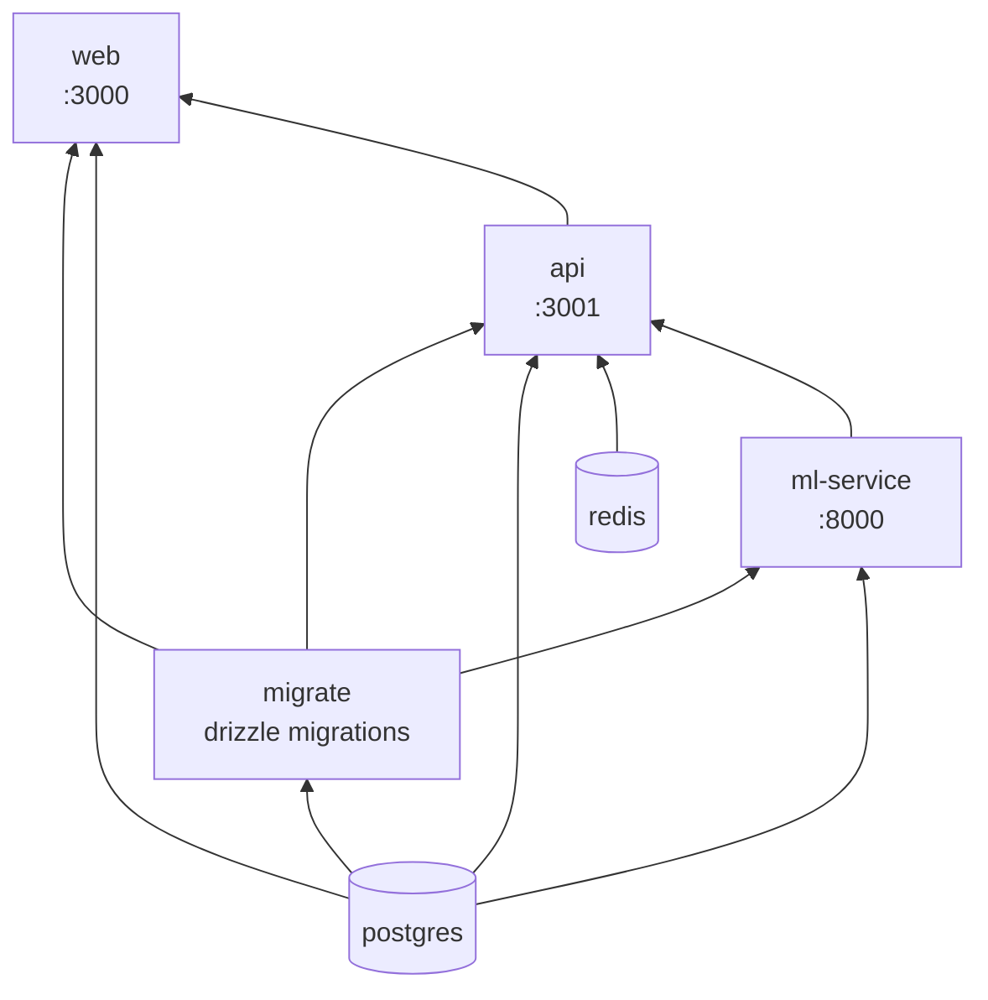

**Source:** `docker-compose.yml`

**Note:** Dependency edges exist in Compose but application-level HTTP calls from `api` → `ml-service` are **NOT FOUND IN CURRENT CODEBASE**.

---

### 6b. Prediction request sequence (implemented path)

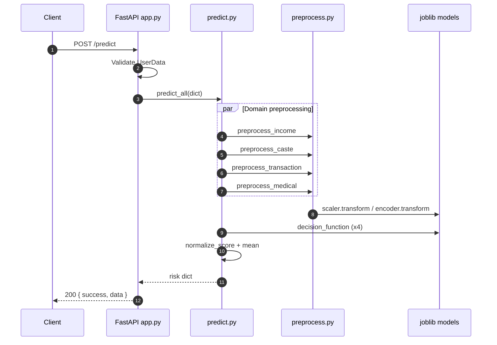

**Source:** `services/ml/src/app.py`, `predict.py`, `preprocess.py`

---

### 6c. Target integrated flow (NOT implemented)

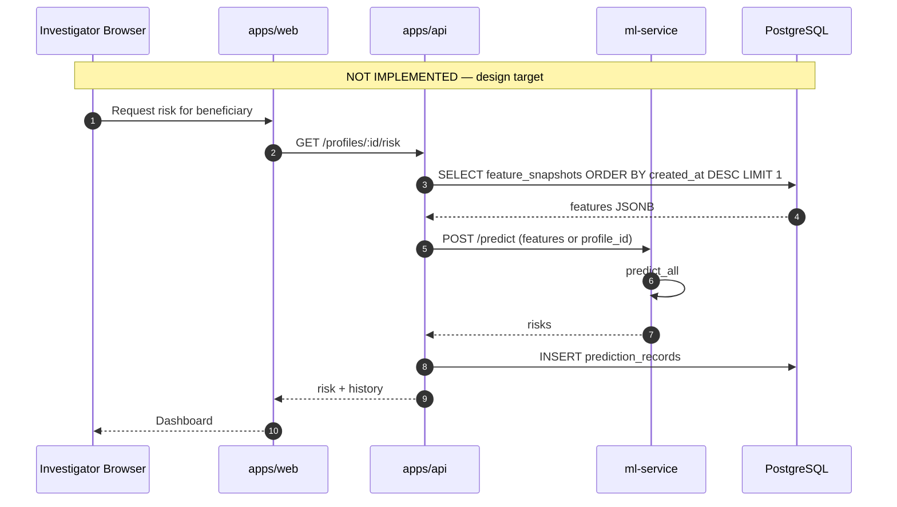

**Sources:** `docs/database-architecture.md`, `docs/UI_ARCHITECTURE.md`

---

## 7. Frontend AI Feature Flow (static UI only)

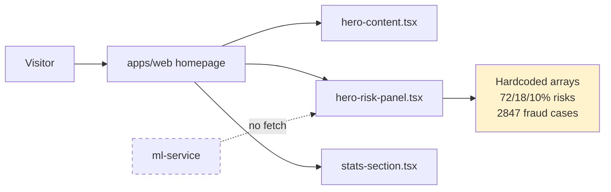

**Source:** `apps/web/src/components/home/hero/hero-risk-panel.tsx` lines 7–11

---

## Diagram Legend

| Symbol | Meaning |
| --- | --- |
| Solid arrow | Implemented in current code |
| Dashed arrow / box | Planned, documented, or NOT FOUND |
| Yellow fill | Hardcoded / mock data |

---

## File Reference Index

| Diagram section | Primary source files |
| --- | --- |
| System architecture | `docker-compose.yml`, `apps/*`, `services/*` |
| ML internals | `services/ml/src/*.py` |
| Data flow | `services/ml/src/train.py`, `packages/db/schema/*` |
| Service communication | `docker-compose.yml`, `services/ml/package.json` |
| Frontend | `apps/web/src/components/home/**` |
| Planned flows | `docs/database-architecture.md` |
