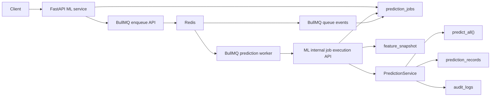
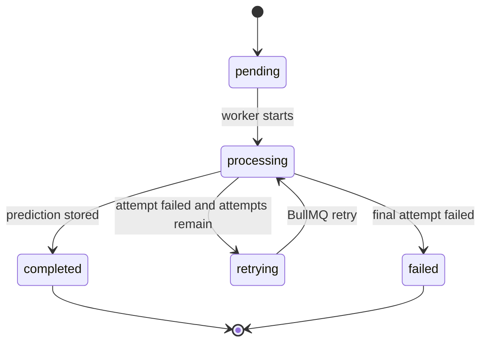

# Asynchronous Prediction Architecture

Phase 6 adds BullMQ-based asynchronous prediction processing around the existing DB-backed prediction lifecycle. The synchronous prediction APIs remain available and unchanged.

## Goals

- Queue prediction work without changing the ML model, preprocessing, feature engineering, risk classification, or prediction algorithms.
- Persist job state in `prediction_jobs`.
- Execute queued jobs through BullMQ with exponential backoff and up to 3 attempts.
- Preserve prediction records, lifecycle metadata, analytics, dashboard APIs, and audit logging.

## Components



## Job Lifecycle

`prediction_jobs.status` supports:

- `pending`
- `processing`
- `completed`
- `failed`
- `retrying`



## Retry Policy

BullMQ jobs are created with:

- `attempts: 3`
- exponential backoff
- initial delay: `1000ms`

The worker calls the ML internal execution endpoint. On failure, it reports `retrying` while attempts remain and `failed` when the final attempt is exhausted.

## Public Endpoints

### Queue Single Prediction

`POST /predictions/queue`

```json
{
  "student_profile_id": "uuid",
  "feature_snapshot_id": "uuid-or-null"
}
```

Returns a persisted prediction job.

### Queue Batch Predictions

`POST /predictions/queue`

```json
{
  "predictions": [
    {
      "student_profile_id": "uuid",
      "feature_snapshot_id": "uuid-or-null"
    }
  ]
}
```

Returns a `batch_id` and the jobs created for the batch.

### Job Status

`GET /predictions/jobs/{job_id}`

Returns the persisted job lifecycle row including status, attempts, errors, timestamps, and result metadata.

### Job Result

`GET /predictions/jobs/{job_id}/result`

Returns the stored prediction result when the job is `completed`. Returns `409` while the job is not complete.

### Queue Analytics

`GET /analytics/queue`

Returns counts by job state, success/failure rates, prediction operational metrics, and recent jobs.

## Internal Worker Endpoints

These are called by the BullMQ worker and event listener:

- `POST /internal/predictions/jobs/{job_id}/execute`
- `POST /internal/predictions/jobs/{job_id}/retrying`
- `POST /internal/predictions/jobs/{job_id}/failed`

They are intentionally separated from the public API surface so the worker can update lifecycle state without changing client behavior.

## BullMQ Services

Worker code lives in `services/workers/src/predictions`.

- `queue.ts`: queue creation and enqueue helper
- `handler.ts`: job handler that calls the ML internal execution API
- `worker.ts`: BullMQ worker process
- `events.ts`: BullMQ event listener
- `server.ts`: Bun HTTP enqueue API used by the ML service

Run locally:

```bash
bun run prediction:queue
bun run prediction:worker
bun run prediction:events
```

Required environment:

```bash
REDIS_URL=redis://localhost:6379
PREDICTION_QUEUE_API_URL=http://localhost:8010
ML_SERVICE_URL=http://localhost:8000
```

## Persistence

`prediction_jobs` stores:

- BullMQ job id
- optional batch id
- student profile id
- optional feature snapshot id
- linked prediction record id
- status
- attempts and max attempts
- last error
- stored result
- lifecycle timestamps

`prediction_records.job_id` links completed async jobs to their prediction output.

## Audit Flow

The worker executes predictions through the existing `PredictionService`, so prediction execution still writes:

- `prediction.executed`
- `prediction.failed`

Snapshot generation remains unchanged and continues to write:

- `snapshot.generated`

## Backward Compatibility

Existing synchronous APIs continue to call `PredictionService` directly. The async path passes `inference_source="async"` and a `job_id`, but it does not alter model code, preprocessing, feature engineering, risk classification, or `predict_all()`.
