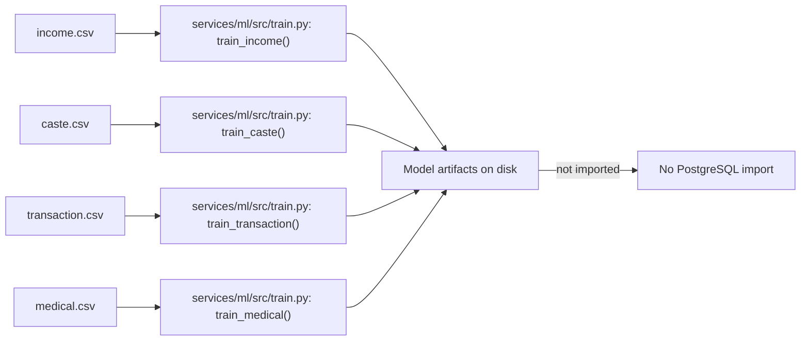
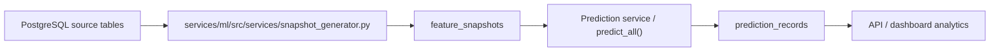

# Data Lineage Verification

This document traces the intended and the actual data lineage for the repository's ML datasets.

## Current status

There are two distinct paths in this repository:

1. **Training-only CSV usage**
2. **Runtime prediction pipeline using PostgreSQL source tables**

The repository does not currently bridge these paths with an automated CSV ingestion service.

## Path A: CSV → training only

All four CSV files are consumed only by the training script.

### Interpretation

- `income.csv`, `caste.csv`, `transaction.csv`, and `medical.csv` are used for training model artifacts only.
- None of these files are loaded into PostgreSQL as part of repository code or startup automation.
- The runtime prediction pipeline is separate from this CSV training path.

## Path B: Runtime production lineage (implemented but without source ingestion)

The runtime feature/prediction pipeline expects source records in PostgreSQL, but there is no CSV loader that populates them.

### Source tables

- `student_financial_records`
- `student_social_records`
- `student_transaction_summaries`
- `student_medical_summaries`
- `student_profiles`

### Evidence

- `services/ml/src/services/snapshot_generator.py` reads latest source records by profile ID.
- `services/ml/src/services/feature_builder.py` constructs runtime features from those tables.
- `services/ml/src/train.py` does not write to those tables; it only reads CSVs.

## Effective lineage conclusion

- `CSV → training only` for the four raw datasets.
- `CSV → importer → PostgreSQL → feature generation → snapshot generation → prediction → analytics` is the intended architecture, but the importer is missing.
- At present the operational runtime pipeline is only valid if the PostgreSQL source tables are populated externally or via a separate future ingestion service.
