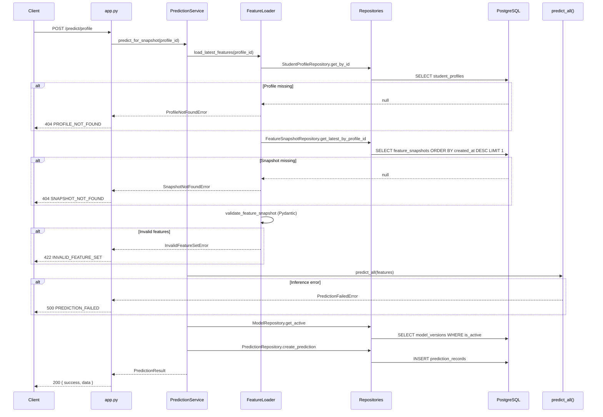

# Inference Pipeline

**Phase 3** — Database-backed ML inference for the welfare fraud detection system.

---

## Overview

Phase 3 connects the existing `predict_all()` pipeline to the PostgreSQL schema introduced in Phase 1/1.1. The legacy `POST /predict` endpoint remains unchanged for backward compatibility. The new `POST /predict/profile` endpoint loads features from `feature_snapshots`, runs inference, and persists outcomes to `prediction_records`.

```text
student_profiles
        ↓
feature_snapshots (latest by created_at)
        ↓
FeatureSnapshotV1 validation
        ↓
PredictionService
        ↓
predict_all()
        ↓
prediction_records
```

---

## Architecture

### Layer responsibilities

| Layer | Location | Responsibility |
| --- | --- | --- |
| API routes | `services/ml/src/app.py` | HTTP binding, error mapping (thin handlers) |
| Prediction orchestration | `services/ml/src/services/prediction_service.py` | Load → validate → infer → persist |
| Feature loading | `services/ml/src/services/feature_loader.py` | Profile + latest snapshot resolution |
| Schema validation | `services/ml/src/schemas/feature_snapshot.py` | Pydantic v1 feature contract |
| Repositories | `services/ml/src/repositories/` | SQLAlchemy data access |
| Inference core | `services/ml/src/predict.py` | Unchanged IsolationForest scoring |
| Preprocessing | `services/ml/src/preprocess.py` | Unchanged scaler/encoder pipeline |

### Design principles

1. **Business logic in services** — Route handlers do not contain DB or inference orchestration.
2. **Reusable `PredictionService`** — Future workers can call `predict_for_snapshot()` with an async session.
3. **Immutable snapshots** — Only the latest snapshot is read; snapshots are never mutated at inference time.
4. **No algorithm changes** — `predict_all()` and model artifacts are untouched.

---

## Sequence Diagram



---

## Feature Snapshot Schema (v1)

Validated by `FeatureSnapshotV1` in `services/ml/src/schemas/feature_snapshot.py`.

| Field | Type | Constraints |
| --- | --- | --- |
| `income_in_rs` | float | required |
| `land_owned_acres` | float | required |
| `vehicles_owned` | int | required |
| `electricity_consumption` | float | required |
| `pending_loans` | int | required |
| `business_ownership` | int | `0` or `1` |
| `caste` | string | `General`, `OBC`, `SC`, `ST` |
| `father_caste` | string | `General`, `OBC`, `SC`, `ST` |
| `avg_caste_population_per` | float | required |
| `officer_approvals_per_day` | float | required |
| `weekly_spending` | float | required |
| `monthly_spending` | float | required |
| `transaction_count` | int | required |
| `avg_transaction_value` | float | required |
| `luxury_items_bought` | int | required |
| `weekend_spending_ratio` | float | required |
| `hospital_visits_per_year` | int | required |
| `claim_frequency` | int | required |
| `medical_claim_amount` | float | required |
| `avg_claim_amount` | float | required |
| `chronic_disease` | int | `0` or `1` |

`feature_schema_version` on the snapshot row must be `"v1"`. Extra JSON keys are rejected (`extra="forbid"`).

---

## API Reference

### `POST /predict` (unchanged)

Legacy payload-based inference. Does **not** read from or write to the database.

### `POST /predict/profile`

**Request:**

```json
{
  "student_profile_id": "550e8400-e29b-41d4-a716-446655440000"
}
```

**Success (200):**

```json
{
  "success": true,
  "data": {
    "prediction_id": "a1b2c3d4-e5f6-7890-abcd-ef1234567890",
    "student_profile_id": "550e8400-e29b-41d4-a716-446655440000",
    "feature_snapshot_id": "660e8400-e29b-41d4-a716-446655440001",
    "model_version_id": null,
    "income_risk": 0.42,
    "caste_risk": 0.38,
    "transaction_risk": 0.51,
    "medical_risk": 0.29,
    "final_risk": 0.40
  }
}
```

**Errors:**

| HTTP | `error` | Condition |
| --- | --- | --- |
| 404 | `PROFILE_NOT_FOUND` | No `student_profiles` row |
| 404 | `SNAPSHOT_NOT_FOUND` | No `feature_snapshots` for profile |
| 422 | `INVALID_FEATURE_SET` | Pydantic validation or unsupported schema version |
| 500 | `PREDICTION_FAILED` | `predict_all()` raised an exception |

---

## Repository Interactions

### `StudentProfileRepository`

- **Method:** `get_by_id(profile_id)`
- **Query:** `SELECT * FROM student_profiles WHERE id = :id`

### `FeatureSnapshotRepository`

- **Method:** `get_latest_by_profile_id(profile_id)`
- **Query:** `SELECT * FROM feature_snapshots WHERE student_profile_id = :id ORDER BY created_at DESC LIMIT 1`

### `ModelRepository`

- **Method:** `get_active()`
- **Query:** `SELECT * FROM model_versions WHERE is_active = true ORDER BY deployed_at DESC NULLS LAST, created_at DESC LIMIT 1`
- **Fallback:** `model_version_id = NULL` on prediction record if none active

### `PredictionRepository`

- **Method:** `create_prediction(...)`
- **Query:** `INSERT INTO prediction_records` with all risk scores and foreign keys

---

## Database Tables Used

```text
student_profiles
    │ 1:N
    ▼
feature_snapshots
    │ 0:N (referenced)
    ▼
prediction_records ──► model_versions (optional FK)
```

| Table | Read | Write |
| --- | --- | --- |
| `student_profiles` | Yes | No |
| `feature_snapshots` | Yes | No |
| `prediction_records` | No | Yes |
| `model_versions` | Yes | No |

---

## Testing Instructions

### Prerequisites

1. PostgreSQL running with migrations applied (`bun run db:migrate` or Docker Compose).
2. ML models trained: `cd services/ml && python src/train.py`
3. ML service running: `cd services/ml && uvicorn src.app:app --reload --port 8000`

### 1. Create a student profile

```sql
INSERT INTO student_profiles (id, external_id, name, region)
VALUES (
  '550e8400-e29b-41d4-a716-446655440000',
  'test-user-1',
  'Test Beneficiary',
  'Rajasthan'
);
```

### 2. Create a feature snapshot

```sql
INSERT INTO feature_snapshots (
  id,
  student_profile_id,
  source,
  features,
  feature_schema_version
) VALUES (
  '660e8400-e29b-41d4-a716-446655440001',
  '550e8400-e29b-41d4-a716-446655440000',
  'api_payload',
  '{
    "income_in_rs": 122962,
    "land_owned_acres": 1.73,
    "vehicles_owned": 2,
    "electricity_consumption": 286,
    "pending_loans": 1,
    "business_ownership": 1,
    "caste": "OBC",
    "father_caste": "OBC",
    "avg_caste_population_per": 0.18,
    "officer_approvals_per_day": 14,
    "weekly_spending": 2504,
    "monthly_spending": 9853,
    "transaction_count": 56,
    "avg_transaction_value": 175,
    "luxury_items_bought": 2,
    "weekend_spending_ratio": 0.19,
    "hospital_visits_per_year": 2,
    "claim_frequency": 2,
    "medical_claim_amount": 3825,
    "avg_claim_amount": 1095,
    "chronic_disease": 1
  }'::jsonb,
  'v1'
);
```

### 3. Call `/predict/profile`

```bash
curl -s -X POST http://localhost:8000/predict/profile \
  -H "Content-Type: application/json" \
  -d '{"student_profile_id": "550e8400-e29b-41d4-a716-446655440000"}' | jq
```

### 4. Verify `prediction_records`

```sql
SELECT
  id,
  student_profile_id,
  feature_snapshot_id,
  model_version_id,
  income_risk,
  caste_risk,
  transaction_risk,
  medical_risk,
  final_risk,
  inference_source,
  created_at
FROM prediction_records
WHERE student_profile_id = '550e8400-e29b-41d4-a716-446655440000'
ORDER BY created_at DESC;
```

### 5. Confirm legacy endpoint still works

```bash
curl -s -X POST http://localhost:8000/predict \
  -H "Content-Type: application/json" \
  -d @services/ml/src/test.py  # use inline JSON from test fixtures instead
```

Or use the sample payload from `docs/ml/API_CONTRACT.md`.

---

## File Index

| File | Purpose |
| --- | --- |
| `src/schemas/feature_snapshot.py` | Pydantic v1 validation |
| `src/repositories/student_profile_repository.py` | Profile lookup |
| `src/repositories/feature_snapshot_repository.py` | Latest snapshot query |
| `src/repositories/prediction_repository.py` | Prediction INSERT |
| `src/repositories/model_repository.py` | Active model version |
| `src/services/feature_loader.py` | Load + validate pipeline |
| `src/services/prediction_service.py` | Full orchestration |
| `src/exceptions.py` | Domain errors |
| `src/app.py` | HTTP routes |
