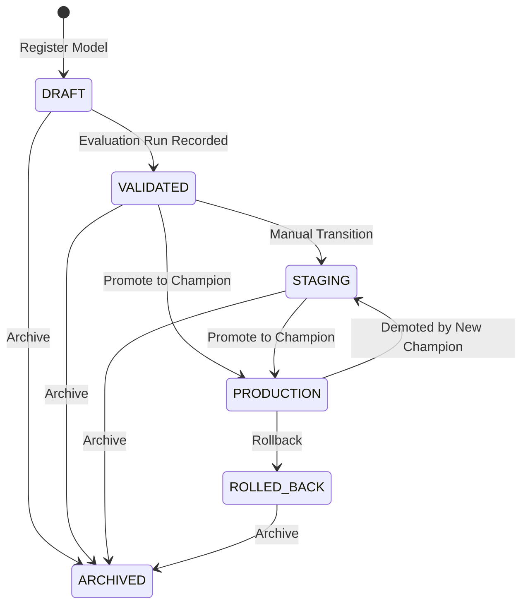

# Model Lifecycle Management

> Phase 8: MLOps & Model Lifecycle Management for the Welfare Fraud Detection System.

This system provides full model registry, champion/challenger management, promotion/rollback workflows, evaluation tracking, lineage recording, and health analytics for the existing IsolationForest models. It does **not** include model training, artifact upload, model serving infrastructure, or retraining pipelines.

---

## Model Lifecycle State Machine



### Status Definitions

| Status | Description |
|---|---|
| `DRAFT` | Newly registered model, not yet evaluated |
| `VALIDATED` | At least one evaluation run recorded |
| `STAGING` | Ready for promotion or demoted from production |
| `PRODUCTION` | Active champion model used for predictions |
| `ARCHIVED` | Retired model, no longer available for promotion |
| `ROLLED_BACK` | Former champion that was rolled back |

---

## Model Registry

The `model_versions` table is extended with lifecycle columns:

| Column | Type | Description |
|---|---|---|
| `status` | `model_status` enum | Lifecycle status (see above) |
| `role` | `model_role` enum | `champion`, `challenger`, or `none` |
| `parent_model_id` | uuid | Lineage: parent model version |
| `artifact_hash` | text | SHA-256 hash of model artifact |
| `training_metadata` | jsonb | Training hyperparameters, dataset info |
| `feature_schema_version` | text | Feature schema this model was trained on |
| `promoted_at` | timestamp | When promoted to PRODUCTION |
| `promoted_by` | text | Who performed the promotion |
| `rolled_back_at` | timestamp | When rolled back |

Existing columns (`is_active`, `deployed_at`, `artifact_uri`, etc.) are **preserved** for backward compatibility. `is_active = true` is synced with `status = PRODUCTION, role = champion`.

---

## Champion/Challenger Workflow

### Rules

- **Only one champion at a time.** The champion is the model used by `PredictionService` for all inference.
- **Challengers** are models being evaluated before promotion. They do not serve predictions.
- **Promotion demotes** the existing champion to `STAGING` with `role = 'none'`, rather than archiving it. This allows re-promotion without re-validation.

### Flow

```
┌─────────────┐     ┌─────────────┐     ┌─────────────┐
│   DRAFT     │────▶│  VALIDATED  │────▶│  PRODUCTION  │
│  (new model)│     │  (evaluated)│     │  (champion)  │
└─────────────┘     └─────────────┘     └──────┬───────┘
                                               │
                          ┌────────────────────┘
                          ▼
                   ┌─────────────┐
                   │   STAGING   │  (previous champion, can be re-promoted)
                   └─────────────┘
```

---

## Promotion Workflow

### Prerequisites

- Model must be in `VALIDATED` or `STAGING` status.
- Model must not already be the champion.

### Steps

1. **Validate** — Confirm the model is in a promotable status.
2. **Demote current champion** — Set existing champion to `STAGING` with `role = 'none'`, set `is_active = false`.
3. **Promote target model** — Set `status = 'PRODUCTION'`, `role = 'champion'`, `is_active = true`, `deployed_at = now()`, `promoted_at = now()`.
4. **Create lineage events** — Record `promoted` event for new champion, `demoted` event for old champion.
5. **Create audit log** — Record the promotion action with actor and metadata.

### API

```http
POST /models/{model_id}/promote
Content-Type: application/json

{
  "promoted_by": "admin@example.com"
}
```

---

## Rollback Workflow

### Prerequisites

- Target model must be the current champion (`role = 'champion'`).

### Steps

1. **Mark current champion as rolled back** — Set `status = 'ROLLED_BACK'`, `role = 'none'`, `is_active = false`, `rolled_back_at = now()`.
2. **Restore previous champion** — Find the last demoted champion from lineage events, restore to `PRODUCTION` / `champion` / `is_active = true`.
3. **Create lineage events** — Record `rolled_back` and `restored` events.
4. **Create audit log** — Record the rollback with reason.

### API

```http
POST /models/{model_id}/rollback
Content-Type: application/json

{
  "reason": "Performance degradation detected",
  "performed_by": "ops@example.com"
}
```

---

## Evaluation Runs

Evaluation runs record model performance metrics against a specific dataset.

### Stored Metrics

| Metric | Type | Description |
|---|---|---|
| `precision` | float | Precision score (0-1) |
| `recall` | float | Recall score (0-1) |
| `f1_score` | float | F1 score (0-1) |
| `false_positive_rate` | float | False positive rate (0-1) |
| `additional_metrics` | jsonb | Any additional metrics |

### Dataset Tracking

| Field | Description |
|---|---|
| `dataset_name` | Name of the evaluation dataset |
| `dataset_version` | Version identifier |
| `sample_size` | Number of samples evaluated |

### Auto-Transition

When the first evaluation run is recorded for a `DRAFT` model, the model is automatically transitioned to `VALIDATED` status.

### API

```http
POST /models/{model_id}/evaluate
Content-Type: application/json

{
  "dataset_name": "welfare_test_set_2024",
  "dataset_version": "v2",
  "sample_size": 1000,
  "precision": 0.92,
  "recall": 0.88,
  "f1_score": 0.90,
  "false_positive_rate": 0.08,
  "evaluated_by": "ml_engineer@example.com"
}
```

---

## Lineage Tracking

Every status and role change is recorded as a lineage event.

### Event Types

| Event | Description |
|---|---|
| `created` | Model registered |
| `validated` | Auto-transitioned to VALIDATED |
| `evaluated` | Evaluation run recorded |
| `promoted` | Promoted to champion |
| `demoted` | Demoted from champion |
| `rolled_back` | Rolled back from champion |
| `restored` | Restored as champion after rollback |
| `archived` | Archived |

### Event Fields

Each event records:
- `from_status` / `to_status` — Status transition
- `from_role` / `to_role` — Role transition
- `metadata` — Additional context (e.g., reason, related model IDs)
- `performed_by` — Actor who triggered the event

---

## Model Health Analytics

The `/analytics/model-health` endpoint aggregates health data:

| Field | Description |
|---|---|
| `champion` | Current champion model info |
| `latest_evaluation` | Most recent evaluation metrics |
| `champion_predictions` | Prediction count, latency, risk stats |
| `champion_uptime_hours` | Hours since champion deployment |
| `latest_drift_score` | Most recent drift monitoring score |
| `false_positive_rate` | FPR from prediction reviews |
| `alert_summary` | Alert counts by type (last 7 days) |
| `total_registered_models` | Total models in registry |

---

## API Reference

| Method | Path | Description |
|---|---|---|
| `GET` | `/models` | List all models (query: `status`, `role`, `limit`) |
| `GET` | `/models/{id}` | Get model detail + evaluation runs + lineage |
| `POST` | `/models` | Register a new model (DRAFT) |
| `POST` | `/models/{id}/promote` | Promote to PRODUCTION/champion |
| `POST` | `/models/{id}/rollback` | Rollback current champion |
| `POST` | `/models/{id}/evaluate` | Record evaluation run |
| `POST` | `/models/{id}/archive` | Archive a model |
| `GET` | `/models/compare?ids=id1,id2` | Compare models side-by-side |
| `GET` | `/analytics/model-health` | Model health dashboard |

---

## Integration Points

| System | Integration |
|---|---|
| **Prediction Service** | Uses `get_champion()` to fetch the active model for inference. Falls back to legacy `get_active()` for backward compatibility. |
| **Drift Monitoring** | Drift scores are included in model health analytics. |
| **Review Workflow** | False positive rate from reviews feeds into model health. |
| **Alert Service** | Alert counts are included in model health analytics. |
| **Audit Logs** | All lifecycle events (register, promote, rollback, archive, evaluate) create audit log entries. |

---

## Database Schema

### Extended: `model_versions`

9 new columns added (see Model Registry section above). All existing columns preserved.

### New: `model_evaluation_runs`

Stores evaluation metrics for each model version. FK to `model_versions` with cascade delete.

### New: `model_lineage_events`

Records all status/role transitions for full audit trail. FK to `model_versions` with cascade delete.

### Migration

File: `packages/db/migrations/0006_phase_8_mlops.sql`

Creates `model_status` and `model_role` enums, extends `model_versions`, creates `model_evaluation_runs` and `model_lineage_events` tables with all indexes.
