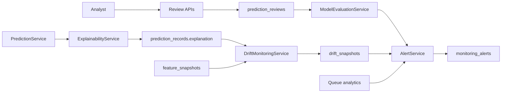

# Model Monitoring and Evaluation

Phase 7 adds explainability, analyst review, model evaluation, drift monitoring, and operational alerting around the existing prediction lifecycle. It does not modify `predict_all()`, preprocessing, feature engineering, risk classification, model artifacts, IsolationForest usage, or BullMQ queue processing.

## Components



## Explainability

`ExplainabilityService` generates deterministic metadata from the existing model inputs and risk outputs:

- top contributing features
- feature values for those signals
- plain-language explanation summary
- explanation method version

The explanation is stored in `prediction_records.explanation` and returned by prediction detail/history analytics. The method is `risk-component-attribution-v1`; it ranks input signals by the risk component they belong to and the risk score produced by the existing model pipeline.

## Analyst Review Workflow

Reviews are stored in `prediction_reviews`.

Fields:

- `prediction_id`
- `reviewer`
- `decision`
- `notes`
- `created_at`

Decision values:

- `pending`
- `confirmed_fraud`
- `false_positive`
- `under_investigation`

Endpoints:

- `POST /predictions/{prediction_id}/review`
- `GET /predictions/reviews`

Creating a review writes a `prediction.reviewed` audit log entry.

## Model Evaluation

`ModelEvaluationService` calculates review-driven metrics:

- reviewed predictions
- confirmed fraud count
- false positives
- precision
- review agreement rate

Endpoint:

- `GET /analytics/model-performance`

Precision is calculated from decisive reviews only:

```text
confirmed_fraud / (confirmed_fraud + false_positive)
```

Review agreement rate is calculated across all reviews:

```text
confirmed_fraud / reviewed_predictions
```

## Drift Monitoring

`DriftMonitoringService` compares a current window against the previous equal-length baseline and stores each run in `drift_snapshots`.

Tracked signals:

- feature distribution changes
- risk distribution changes
- prediction volume changes

Endpoint:

- `GET /analytics/drift?days=7`

The drift score is the maximum absolute percentage change across tracked feature means, average risk, and volume.

## Alerting Foundation

Alerts are stored in `monitoring_alerts`.

Supported alert types:

- `MODEL_DRIFT`
- `HIGH_FAILURE_RATE`
- `QUEUE_BACKLOG`
- `HIGH_FALSE_POSITIVE_RATE`

Endpoint:

- `GET /analytics/alerts`

The endpoint generates alerts from the latest monitoring metrics and returns both generated and recent stored alerts. Thresholds are intentionally conservative and can be tuned later without changing prediction execution.

## Backward Compatibility

Phase 7 preserves:

- synchronous prediction APIs
- asynchronous BullMQ prediction APIs
- prediction lifecycle APIs
- analytics APIs
- dashboard APIs
- audit logging
- snapshot generation
- existing model and preprocessing code

The new services observe and annotate prediction behavior; they do not alter prediction algorithms or model execution.
