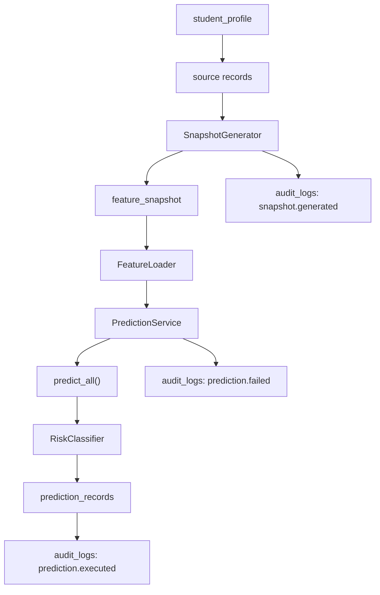
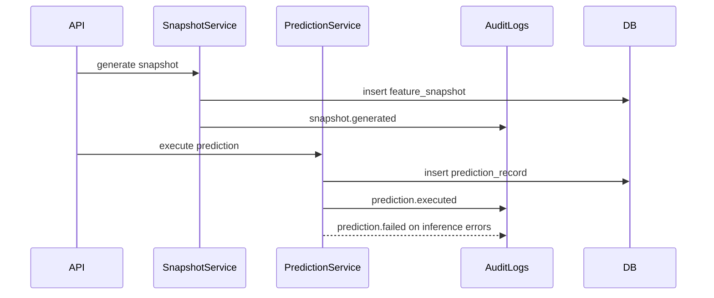
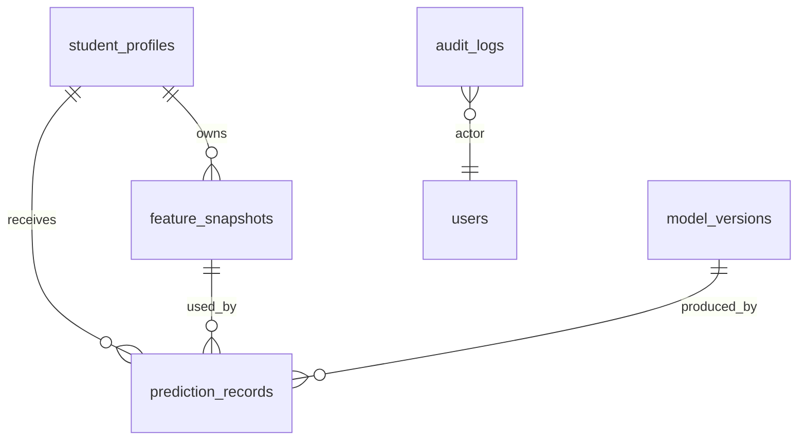

# Prediction Lifecycle and Model Governance

Phase 5 adds lifecycle metadata, auditability, analytics, and dashboard support around the existing DB-backed inference path. It does not retrain models, replace IsolationForest, change preprocessing, introduce workers, or modify `predict_all()`.

## Lifecycle



The prediction service loads the latest validated feature snapshot, runs the existing inference function, classifies the final risk score, records metadata, and writes an audit event.

## Prediction Metadata

`prediction_records` now supports these lifecycle fields:

- `prediction_timestamp`
- `model_name`
- `model_version`
- `snapshot_checksum`
- `prediction_duration_ms`
- `risk_level`

Existing records remain compatible because the columns are nullable and migration backfills best-effort values from `created_at`, linked `model_versions`, linked `feature_snapshots`, and `final_risk`.

## Risk Classification

Risk classification is centralized in `services/ml/src/services/risk_classifier.py`.

| Score range | Classification |
| --- | --- |
| `0.00 - 0.30` | `LOW` |
| `0.31 - 0.60` | `MEDIUM` |
| `0.61 - 1.00` | `HIGH` |

Scores are bounded to `0.0 - 1.0` before classification. The classification is stored in `prediction_records.risk_level`.

## Model Versioning

The prediction service uses the active row from `model_versions` when available. The prediction record stores both:

- `model_version_id`, preserving the relational link
- `model_name` and `model_version`, preserving point-in-time readable metadata

History APIs also expose joined model version metadata when the linked model version still exists.

## Audit Flow



Audit actions:

- `snapshot.generated`
- `prediction.executed`
- `prediction.failed`

## Analytics Endpoints

`PredictionAnalyticsService` provides:

- total predictions
- average risk
- high risk count
- low risk count
- predictions by model version
- predictions by date

`GET /analytics/predictions` returns these aggregate analytics as JSON.

## API Endpoints

### Prediction History

`GET /predictions/{student_profile_id}`

Returns:

- `latest_prediction`
- `prediction_history`
- `associated_snapshots`
- `model_version_metadata` inside prediction records when available

### Prediction Details

`GET /predictions/{prediction_id}`

Returns full prediction details including linked snapshot and model version metadata when the UUID does not resolve to profile prediction history.

`GET /predictions/detail/{prediction_id}` is also available as an explicit unambiguous alias.

Note: `GET /predictions/{student_profile_id}` and `GET /predictions/{prediction_id}` are path-ambiguous when both identifiers are UUIDs. The shared route checks profile history first, then prediction details.

### Operational Metrics

`GET /metrics/predictions`

Returns JSON:

```json
{
  "total_predictions": 0,
  "failed_predictions": 0,
  "average_latency": 0,
  "latest_model_version": null,
  "high_risk_percentage": 0
}
```

### Dashboard Summary

`GET /dashboard/summary`

Returns JSON:

```json
{
  "profiles": 0,
  "snapshots": 0,
  "predictions": 0,
  "high_risk": 0,
  "medium_risk": 0,
  "low_risk": 0
}
```

## Persistence



The lifecycle tables remain append-only from the inference perspective: snapshots and predictions are inserted, while audit logs record observability events.
